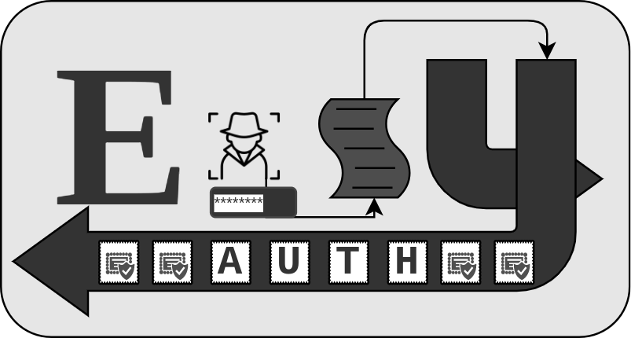
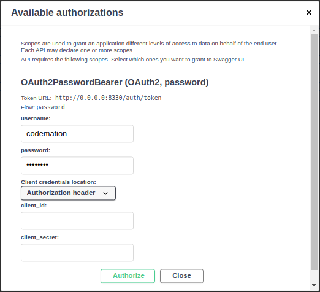

<br>
#
Create a centralized Authentication and Authorization token server. Easily secure FastAPI endpoints based on Users, Groups, Roles or Permissions with very little database usage.

# Quick Start
```bash

$ virtualenv -p <python3.X> easy-auth-env
$ source easy-auth-env/bin/activate

$ pip install easyauth[all]

```
#  Basic Server

Configure require env variables via a .json
```Bash
$ cat > server_env.json <<EOF
{
    "DB_TYPE": "sqlite",
    "DB_NAME": "auth",
    "ISSUER": "EasyAuth",
    "SUBJECT": "EasyAuthAuth",
    "AUDIENCE": "EasyAuthApis",
    "KEY_PATH": "/my_key-location",
    "KEY_NAME": "test_key"
}
EOF
```


```python
#test_server.py
from fastapi import FastAPI

from EasyAuth.server import EasyAuthServer

server = FastAPI()

@server.on_event('startup')
async def startup():
    server.auth = await EasyAuthServer.create(
        server, 
        '/auth/token',
        env_from_file='server_env.json'
    )

```
Start Sever
```bash
$ uvicorn --host 0.0.0.0 --port 8330 test_server:server
```
```python
"""
When a server is started for the first time, detected by table creation (database tables not existing yet), a new admin user / group / role / action is created automatically, search in logs for # the password:
"""
```

```
01-25 10:32 EasyAuthServer ERROR    detected new EasyAuth server, created admin user with password: ymbuvwop
```

## Keys
When an EasyAuthServer starts, it checks the provided KEY_NAME  & KEY_PATH location for existing keys, if none exist they are created.
<br>

```bash
$ ls test_key*
test_key.key  test_key.pub
```
<br>

### Important .key file must be kept safe!
Do not store in the paths monitored by git to avoid accidental commit.
<br>

The .pub file should be copied to any separate apps which you want to use this EasyAuthServer.
<br>

 If either key is, ever lost, they will be re-created on the EasyAuthServer in the KEY_PATH location upon restart. 

<br>

If a .key is re-created, the new .pub key must be copied to all EasyAuthClients
<br>

# API

This new admin user is required to access the APIs pre-created at
the listening server location:
```bash
01-25 10:32 uvicorn.error INFO     Application startup complete.
INFO:     Uvicorn running on http://0.0.0.0:8330 (Press CTRL+C to quit)
```
### See 0.0.0.0:8330/docs
<br>


# Basic Client

Configure require env variables via a .json
```Bash
$ cat > server_env.json <<EOF
{
    "KEY_PATH": "/my_key-location",
    "KEY_NAME": "test_key"
}
EOF
```

```python
#test_client.py
from fastapi import FastAPI

from EasyAuth.client import EasyAuthClient

server = FastAPI()

@server.on_event('startup')
async def startup():
    server.auth = await EasyAuthClient.create(
        server, 
        'http://0.0.0.0:8330/auth/token', # Should be a running EasyAuthServer 
        env_from_file='client_env.json'
    )

    # grants access to only specified users
    @server.auth.get('/', users=['jane'])
    async def root():
        return f"I am root"
    
    # grants access to members of 'users' or 'admins' group.
    @server.auth.get('/groups', groups=['users', 'admins'])
    async def groups():
        return f"I am groups"
    
    # grants access to all members of group which a role of 'basic' or advanced, or member 'users' group
    @server.auth.get('/roles', roles=['basic', 'advanced'], groups=['users'])
    async def roles():
        return f"I am roles"

    # grants access to all members of groups with a roles granting 'BASIC_CREATE'
    @server.auth.get('/actions', actions=['BASIC_CREATE'])
    async def action():
        return f"I am actions"
```



## Under the hood

When providing a username & password, the EasyAuthServer returns a Bearer Token containing all the users permissions. 
<br>

If the permissions match the endpoints configured users / groups / roles / actions, the request is allowed. 


## Database Usage
The default 'batteries mostly included' implementation utilizes a sqlite database managed by aiopyql.
<br><br>

Supported Databases: <br>
* sqlite
* mysql
* postgres

```bash
cat > server_env.json << EOF
{
    "DB_TYPE": "mysql",
    "DB_NAME": "auth",
    "DB_HOST": "0.0.0.0",
    "DB_PORT": "3306",
    "DB_USER": "mysqluser",
    "DB_PASSWORD": "my-secret",
    "ISSUER": "EasyAuth",
    "SUBJECT": "EasyAuthAuth",
    "AUDIENCE": "EasyAuthApis",
    "KEY_PATH": "/home/josh/Documents/python/EasyAuth/EasyAuth",
    "KEY_NAME": "test_key"
}
EOF
```
