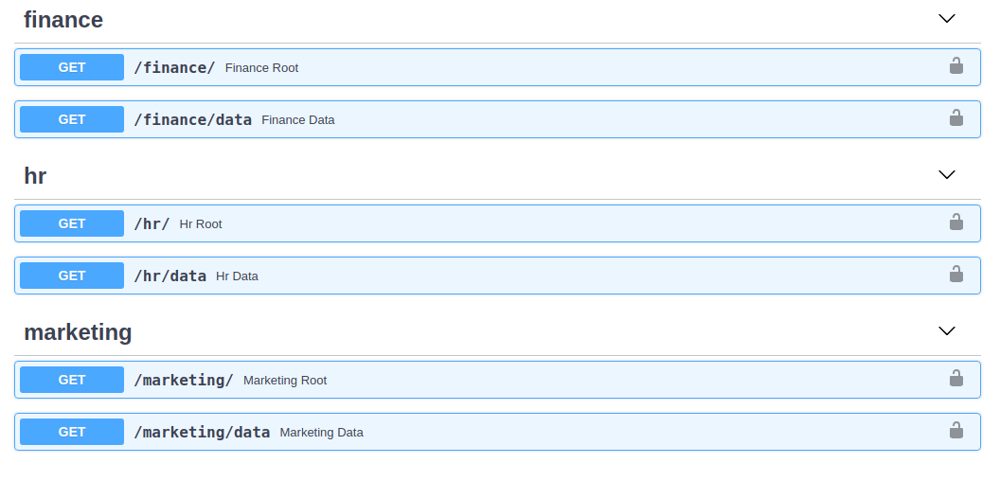

## Client

### Required Environment Varaibles
Configure require env variables via a .json
```Bash
$ cat > client_env.json <<EOF
{
    "KEY_PATH": "/my_key-location",
    "KEY_NAME": "test_key"
}
EOF
```
### Client Usage

```python
#test_client.py
from fastapi import FastAPI

from easyauth.client import EasyAuthClient

server = FastAPI()

@server.on_event('startup')
async def startup():
    server.auth = await EasyAuthClient.create(
        server, 
        'http://0.0.0.0:8330/auth/token', # Should be a running EasyAuthServer 
        env_from_file='client_env.json',
        default_permissoins={'groups': ['users']}
    )

    # grants access to users matching default_permissions
    @server.auth.get('/default')
    async def default():
        return f"I am default"

    # grants access to only specified users
    @server.auth.get('/', users=['jane'])
    async def root():
        return f"I am root"
    
    # grants access to members of 'users' or 'admins' group.
    @server.auth.get('/groups', groups=['users', 'admins'])
    async def groups():
        return f"I am groups"
    
    # grants access to all members of 'users' group 
    # or a groups with role of 'basic' or advanced
    @server.auth.get('/roles', roles=['basic', 'advanced'], groups=['users'])
    async def roles():
        return f"Roles and Groups"

    # grants access to all members of groups with a roles granting 'BASIC_CREATE'
    @server.auth.get('/actions', actions=['BASIC_CREATE'])
    async def action():
        return f"I am actions"
```
!!! NOTE "default_permissions, if unspecified"
    {'groups': ['administrators']}

### APIRouter
FastAPI provides a [APIRouter](https://fastapi.tiangolo.com/tutorial/bigger-applications/?h=apirouter#apirouter) object for defining path prefixes, pre-defined dependencies, see fastapi docs for more details. EasyAuthClient can extend the main FastAPI router using the .create_api_router() method. 

!!! Important - "APIRouter Considerations "
    APIRouter's must be created and distributed at runtime, instead of just imported & included.

```python
from fastapi import FastAPI, Request, Depends
from fastapi.responses import HTMLResponse
from typing import Optional

from easyauth.client import EasyAuthClient

server = FastAPI(openapi_url="/groups/openapi.json")

@server.on_event('startup')
async def startup():
    server.auth = await EasyAuthClient.create(
        server, 
        'http://0.0.0.0:8220/auth/token', # Should be a running EasyAuthServer 
        env_from_file='client_env.json'
    )

    finance_auth_router = server.auth.create_api_router(prefix='/finance', tags=['finance'])
    hr_auth_router = server.auth.create_api_router(prefix='/hr', tags=['hr'])
    marketing_auth_router = server.auth.create_api_router(prefix='/marketing', tags=['marketing'])

    # import sub modules
    from .finance import finance
    from .hr import hr
    from .marketing import marketing

    # send auth routers to setup of each sub-module
    await finance.setup(finance_auth_router)
    await hr.setup(hr_auth_router)
    await marketing.setup(marketing_auth_router)
```

```python
#finance/finance.py
# finance setup
async def setup(router):

    @router.get('/')
    async def finance_root():
        return f"fiance_root"
    
    @router.get('/data')
    async def finance_data():
        return f"finance_data"

```
!!! TIP
    server.auth.create_api_router() is a wrapper around FastAPI's APIRouter, accepting and passing the same arguments, but also automatically including the router at startup.

```
.
├── app
│   ├── __init__.py
│   ├── server.py
│   └── marketing
│   │   ├── __init__.py
│   │   ├── marketing.py
│   └── finance
│   │   ├── __init__.py
│   │   ├── finance.py
│   └── hr
│       ├── __init__.py
│       └── hr.py
```



### Permissions
EasyAuth allows endpoints to be as exclusive or as inclusive as needed. Authorization is granted if user meets at least 1 condition. 
```python
@server.auth.get(
    '/roles', 
    roles=['basic'],  # OR
    groups=['users'], # OR
    actions=['CREATE_BASIC'] 
)
```


### Cookies
EasyAuth client endpoints, decorated by the auth router, that serve HTML responses or static webcontent are provided default integrated login endpoints at /login /logout.


!!! Note
    Once logged in, the browser will contain a authenticatin cookie that matches the users token


